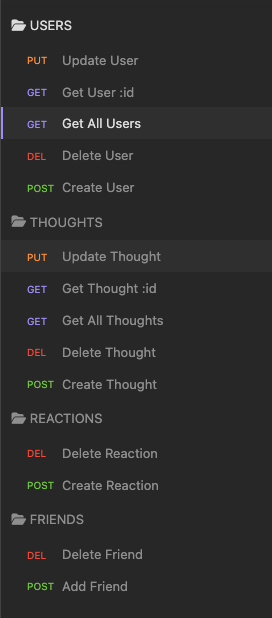
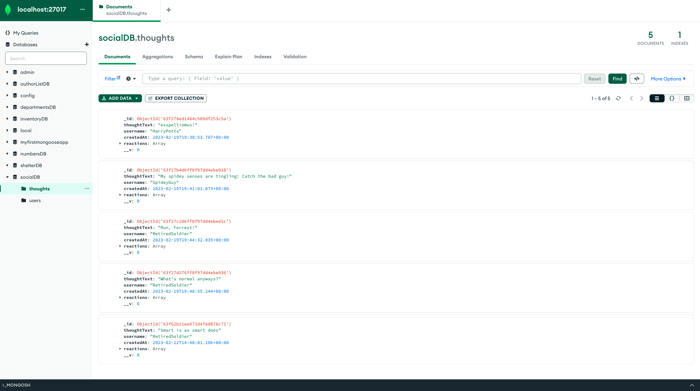
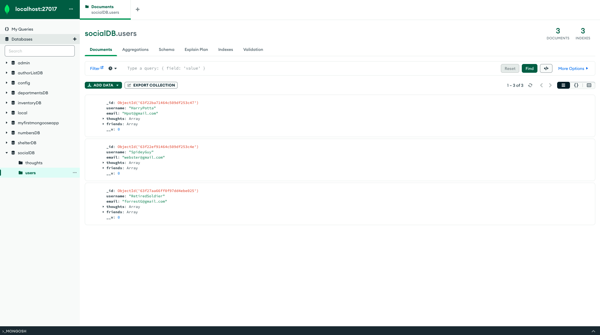
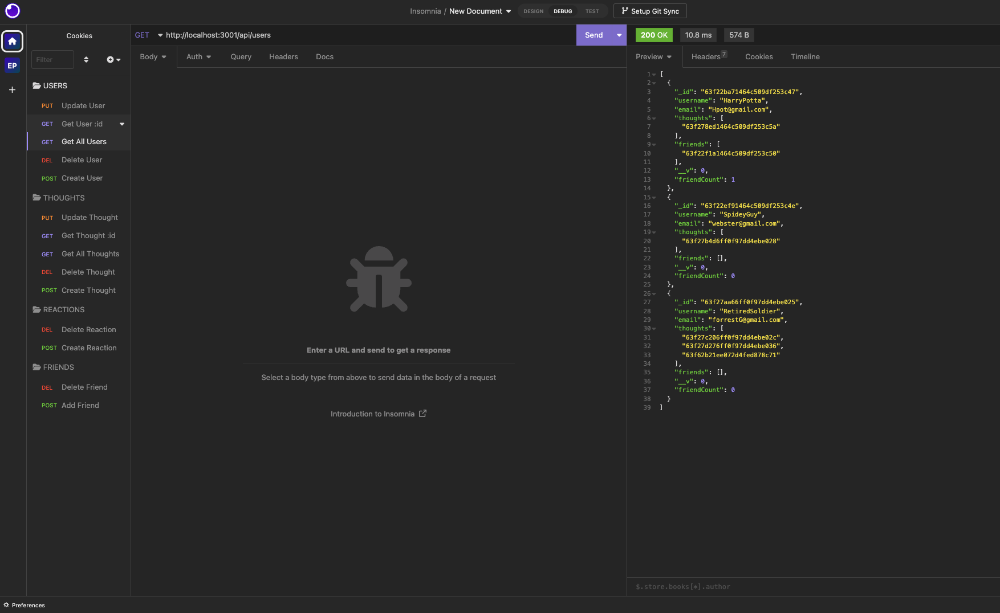
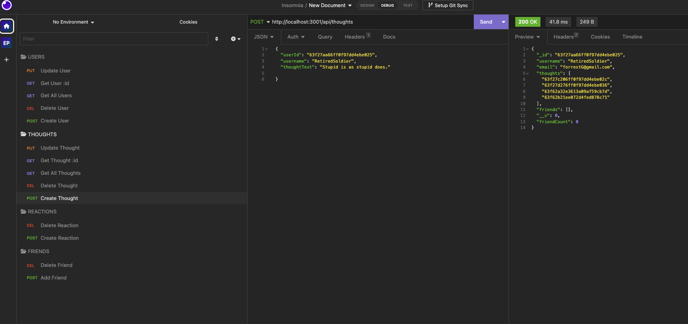
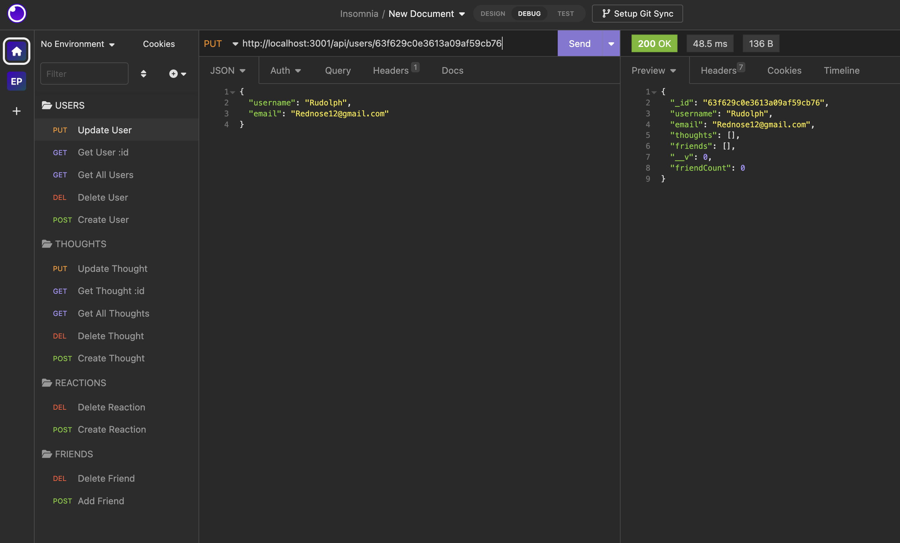
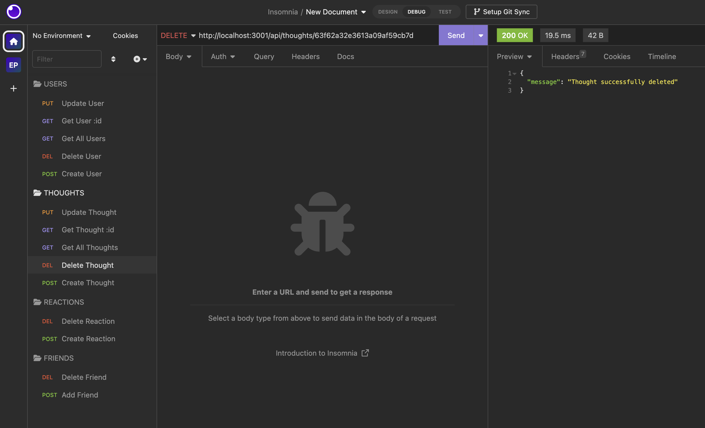

# Social-Network-API

[](https://lbesson.mit-license.org/)
https://lbesson.mit-license.org/

## Description

Building an API for a social network web application where users can share their thoughts, react to friends’ thoughts, and create a friend list. 

## User Story
```
AS A social media startup
I WANT an API for my social network that uses a NoSQL database
SO THAT my website can handle large amounts of unstructured data
```
## Acceptance Criteria
```
GIVEN a social network API
WHEN I enter the command to invoke the application
THEN my server is started and the Mongoose models are synced to the MongoDB database
WHEN I open API GET routes in Insomnia for users and thoughts
THEN the data for each of these routes is displayed in a formatted JSON
WHEN I test API POST, PUT, and DELETE routes in Insomnia
THEN I am able to successfully create, update, and delete users and thoughts in my database
WHEN I test API POST and DELETE routes in Insomnia
THEN I am able to successfully create and delete reactions to thoughts and add and remove friends to a user’s friend list
```
## Table of Contents

- [Application Preview](#application-preview)
- [Features](#features)
- [Installation](#installation)
- [Usage](#usage)
- [Technologies](#technologies)
- [License](#license)
- [Questions](#questions)

### Application Preview
All GET POST PUT DELETE route for Users, Thoughts, Friends, Reactions.



Once the application is invoked the data will synce to the Mongodb server.





Check out the full [Walkthrough Video](https://drive.google.com/file/d/1_3XAvv4iwZNQoOEUDMPeQ7NQ3ByiX0aU/view) by clicking the link!
### Features

In this app User, Friend, Thought, and Reaction routes are created to create the database and test the API on Insomnia.

With the `User` and `Thought` routes you will be able to use the following methods:

- GET 
> Returns the data from the API and using a JSON format 


- POST
> Used to create new data in the database 


- PUT 
> Used to update data in the database 


- DELETE
> Deletes data in the database



With the `Friend` and `Reaction` routes  you will be able to create and delete data.

### Installation
In order to use this code on your local machine download or clone this repository
`Node.js` and `MongoDB` are required to run the application
To install necessary dependencies, navigate to the root directory and run the following command: 
```
npm i 
```
### Usage

- Run this application in the command line by running:
```
npm start
```
- Once the command is invoked the server will be started and the mongoose models will be synced to the MongoDb database.
- Connect to the MongoDB URI mongodb://localhost:27017. Here you will be able to access both the thoughts and users data on the social DB. 
- Insomnia was used to create and test API routes.

### Technologies

- JavaScript
- Express.js
- Node.js
- MongoDB
- Mongoose
- Insomnia
- Moment.js

### License 

This project is covered under the MIT license. To learn more about what this means, click the license button at the top.
## Questions
Ezinma Nwankwo 

A driven developer at the University of New Hampshire currently completing a certification in full-stack development.

* Email: ezinmark@gmail.com
* Github: https://github.com/Ezmaa
* LinkedIn: [Ezinma-Nwankwo](linkedin.com/in/ezinma-nwankwo-3b7905234)